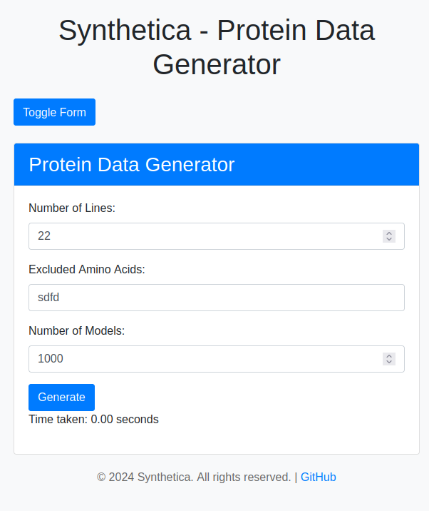

# ProteoSynth


## About the repo
ProteoSynth is a tool that automates creating custom proteins of random amino acid sequences. 
You can specify the length of sequences, amino acids to avoid in sequence, and the number of proteins to be generated.


## How to install

1.  Install from this repo as:

```
git clone https://github.com/Pushkar1853/ProteoSynth.git 
```

2.  Create a virtual environment  

```
python3 -m venv env 
source env/bin/activate
```

3.  To Run this flask app:

```
python3 app.py
```
## How to Use



1) Enter size of amino acid sequences you want for each protein. (eg:- 10)
2) Enter single-letter codes for the amino acids you want to avoid (optional) in sequences (eg:- A,r,N d)
3) Enter number of proteins you want (eg:- 10000)
4) By clicking 'Generate Protein Data' button, you will be downloading .zip file of specified number of .pdb files with random amino acid sequences of specified length avoiding specified amino acids.


## Requirements:

1.  Packages:
* Flask == 3.0.3
* Pip == 22.0.2
* python == 3.10.12

2.  System Requirements:
* Ubuntu == 22.04 (version)
  
  ```
  (Linux OS preferably,  
  for Windows -> use WSL
  for MAC -> use VirtualBox)
  ```


