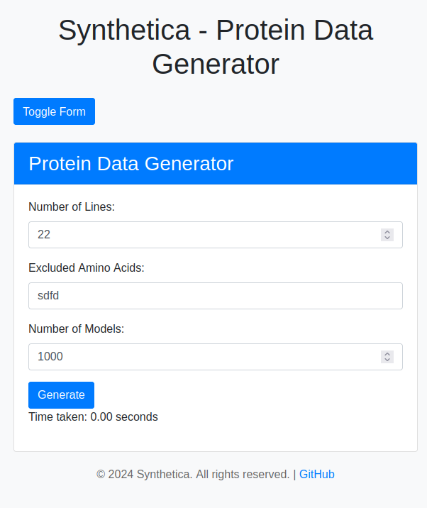

# Synthetica

## About the repo
Synthetica is an automated tool for generating custom proteins with randomized amino acid sequences. Users can define the sequence length, specify which amino acids to exclude, and determine the desired quantity of generated proteins.

## How to install
1. Open the Linux Terminal & execute the following Linux Command that will update all the packages installed there.
```
 sudo apt update
```
2. Now, directly paste the following command in the Terminal & execute it. It will directly download the latest Python File.

```
 sudo apt install python3
```
3.  Install from this repo as:

```
git clone https://github.com/a-m-a-nkumar/Synthetica.git 
```
4.  Move into project directory:

```
cd Synthetica
```
5.  Make Ribosome executable:

```
chmod +x ribosome
```

6.  After going to the project directory, install the flask:

```
pip install flask
```
7.  To run the flask app:

```
python3 app.py
```
## How to Use



1) Provide the size of amino acid sequences you desire for each protein (e.g., 10).

2) Specify the single-letter codes for any amino acids you wish to exclude from the sequences (optional) (e.g., A, R, N, D).

3) Indicate the number of proteins you require (e.g., 10000).

4) Upon clicking the 'Generate Protein Data' button, you will download a .zip file containing the specified number of .pdb files. These files will contain random amino acid sequences of the specified length while avoiding the specified amino acids.


## Requirements:

1.  Packages:
* Flask == 3.0.3
* Pip == 22.0.2
* python == 3.10.12

2.  System Requirements:
* Ubuntu == 22.04 (version)
  
  ```
  (Linux OS preferably,  
  for Windows -> use WSL
  for MAC -> use VirtualBox)
  ```


